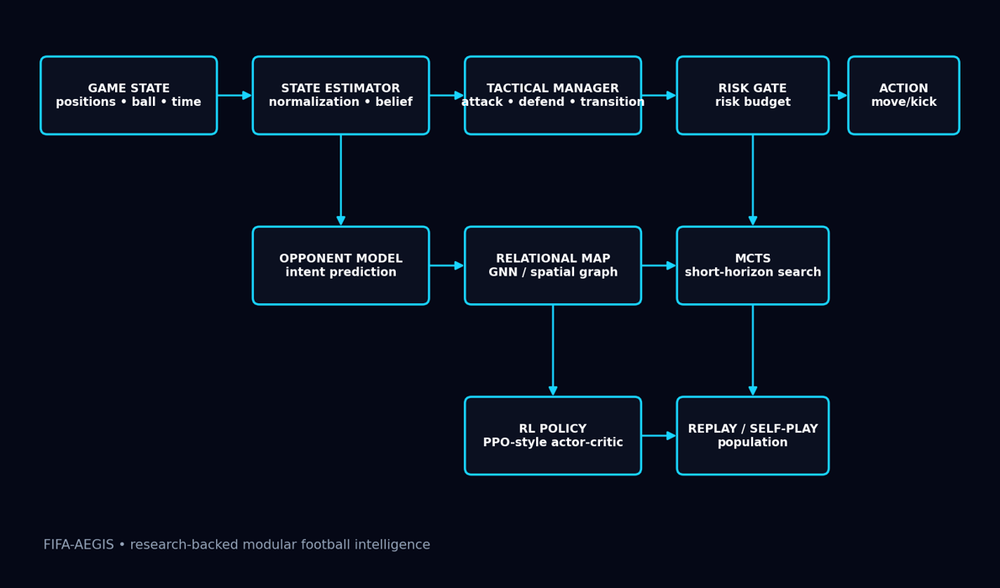
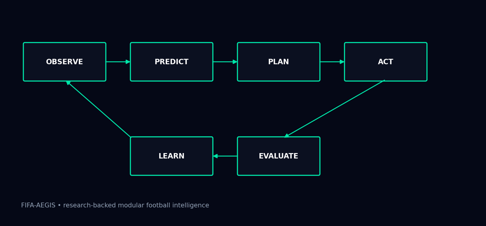
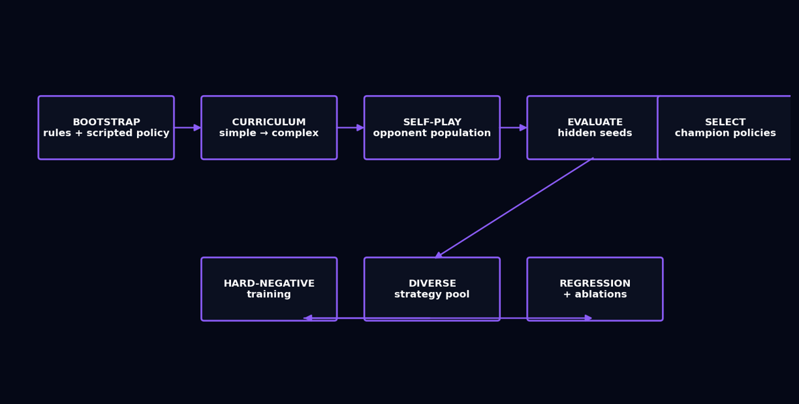

# ⚽ FIFA-AEGIS: Adaptive Expected-Goal Intelligence System


> **Autonomous 2D Football Agent Architecture for Conv_Cup '26 (FIFA of AI / ML RL Challenge)**

A research-grounded, modular control architecture that decouples **spatial estimation, tactical risk gating, and real-time execution** for deterministic 2D soccer arenas.



---

##  1. Executive Summary & Design Thesis

Modern reinforcement learning agents in simulated sports often suffer from **policy collapse, catastrophic forgetting, and severe sensitivity to seed initialization** when trained as single end-to-end monolithic networks.

**FIFA-AEGIS** resolves this fragility through a hierarchical, risk-aware architecture specifically adapted to the **1v1 continuous-space dynamics** of the Conv_Cup '26 environment.

Instead of forcing a single policy to handle both long-term tournament strategy and low-level trajectory physics, FIFA-AEGIS decouples tactical intent from low-level execution.

> [!IMPORTANT]
> **Goal differential is the one metric that matters.** Maximizing net goal differential takes strict precedence over possession-oriented vanity metrics.

### Core Design Principles

- **Goal-Centric Optimization:** Maximizing net goal differential takes strict mathematical precedence over possession-oriented vanity metrics.
- **Hierarchical State Control:** High-level tactical state machines govern agent aggression, while low-level kinematic controllers execute pathing and obstacle repulsion.
- **Event-Triggered Search:** High-overhead search and tactical overrides fire exclusively during high-leverage inflection events such as loose balls, open-net trajectories, and defensive emergencies.
- **Deterministic Robustness:** The architecture is designed to generalize across unseen random seeds, randomized obstacle layouts, and alternating-side tournament fixtures.

The core objective:

```text
ΔG = Goals Scored − Goals Conceded
```

---

##  2. Competition Context & Rules Compliance

FIFA-AEGIS is designed around the official **Conv_Cup '26 / MLFootball environment** participant specification.

| Parameter / Rule | Specification | Architectural Adaptation |
| --- | --- | --- |
| **Arena Dynamics** | 2D continuous pitch, elastic boundaries, static circular obstacles | Potential-field navigation and repulsive-vector obstacle avoidance |
| **Match Format** | 1v1 autonomous duel with alternating `left` / `right` sides | Asymmetric coordinate normalization relative to the home goal |
| **I/O Contract** | Strict JSON actions through `stdout`; diagnostics through `stderr` | Lightweight serialized action projector |
| **Latency Budget** | Strictly `< 2.0 seconds` per decision turn | Sub-millisecond heuristic fallback for ordinary states |
| **Execution Safety** | Zero networking, zero subprocesses, zero unapproved dependencies | Pure Python mathematical core |
| **Tournament Engine** | Double-elimination bracket with aggregate goal tie-breakers | Dynamic risk scaling based on series aggregate scoreline |

> [!WARNING]
> **Hard rules:** every decision must return in under **2.0 seconds**, with **zero networking, zero subprocesses and zero unapproved dependencies**. Breaking any of these risks disqualification.

---

##  3. System Architecture

The FIFA-AEGIS pipeline processes raw environmental observations through decoupled functional layers before producing an actuation payload.

### Core System Modules

| Module | Core Functionality | Primary Output |
| --- | --- | --- |
| **State Estimator** | Normalizes positions, infers relative velocities, ball trajectory, and obstacle margins | Structured kinematic state vector `z_t` |
| **Opponent Model** | Tracks closing velocity, predicts tackling intent, and evaluates passing/shooting angles | Opponent threat and trajectory probabilities |
| **Relational Map** | Constructs a spatial graph of the agent, opponent, ball, and field obstacles | Spatial feature embedding |
| **Tactical Manager** | Determines operational mode: `ATTACK`, `DEFEND`, `COUNTER`, `RECOVER` | Active macro objective |
| **Dynamic Risk Gate** | Computes allowable operational risk based on clock, goal margin, and threat | Scalar risk budget `R_t` |
| **Action Planner** | Evaluates geometric clearance lines and scoring cones using tactical rules and local search | Candidate action trajectory |
| **Action Projector** | Enforces physical velocity clamps, legal kick boundaries, and JSON schemas | Verified JSON action command |

---

### 3.1 Mathematical State Representation

The spatial environment is parsed into an invariant state frame:

```text
x_agent = [ p_x, p_y, v_x, v_y, d_ball, θ_ball, d_goal, θ_goal, possession ]
```

Where:

- `p_x`, `p_y` = agent position
- `v_x`, `v_y` = agent velocity
- `d_ball` = distance to ball
- `θ_ball` = relative ball angle
- `d_goal` = distance to opponent goal
- `θ_goal` = relative goal angle
- `possession` = estimated possession state

#### Obstacle Avoidance

Obstacle interactions are modeled through an augmented repulsive vector:

```text
                 M       η
F_repulse  =     Σ   ───────────  ·  û_repulse,k
                k=1  (d_k − r_k)²
```

Where:

- `d_k` = Euclidean distance to obstacle `k`
- `r_k` = obstacle radius
- `η` = repulsion strength
- `û_repulse,k` = unit vector pointing away from the obstacle center
- `M` = number of relevant obstacles

This mechanism provides smooth obstacle avoidance while reducing the probability of corner-pinning and repeated movement cycles.

---

## 🔁 4. Decision Algorithm & Control Hierarchy

The operational pipeline follows a strict synchronous execution loop:

```text
OBSERVE
   ↓
PREDICT
   ↓
PLAN
   ↓
ACT
   ↓
EVALUATE
   ↓
LEARN
```



### AEGIS Decision Procedure

```text
Algorithm AEGIS-DECIDE(observation):

    z      ← STATE_ESTIMATE(observation)

    threat ← OPPONENT_MODEL(
                 z,
                 match_history
             )

    mode   ← TACTICAL_MANAGER(
                 z,
                 score_differential,
                 time_remaining
             )

    risk   ← DYNAMIC_RISK_GATE(
                 mode,
                 score_differential,
                 time_remaining,
                 threat
             )

    if IS_HIGH_LEVERAGE(z, mode):

        action ← SHORT_HORIZON_PLANNER(
                     z,
                     risk,
                     mode
                 )

    else:

        action ← HEURISTIC_TACTICAL_POLICY(
                     z,
                     mode
                 )

    return ACTION_PROJECTOR(action)
```

The architecture therefore separates:

1. **Perception**
2. **Opponent prediction**
3. **Tactical state selection**
4. **Risk allocation**
5. **Trajectory planning**
6. **Physical action validation**

---

### 4.1 Dynamic Risk Budget

The agent regulates strategic conservation versus aggressive pressure using a parameterized dynamic risk gate:

```text
Risk_t = clip( r_0 + k_1·ΔMargin + k_2·T_late + k_3·D_box − k_4·Threat_counter ,  r_min ,  r_max )
```

Where:

- `r_0` = baseline risk
- `ΔMargin` = current goal-margin pressure
- `T_late` = normalized late-game factor
- `D_box` = defensive-box pressure factor
- `Threat_counter` = estimated counter-attack threat
- `r_min` = minimum allowed risk
- `r_max` = maximum allowed risk

```diff
+ TRAILING LATE   →  risk budget rises toward r_max   (attack!)
- LEADING         →  risk budget falls toward r_min   (protect!)
```

#### 🔺 Trailing in the Final Minutes

When the agent is behind late in the match, the risk budget increases toward `r_max`.

This enables:

- Direct goal rushes
- Aggressive shooting
- High-line interceptions
- Reduced conservative positioning
- Faster transitions

####  Defending a Lead

When protecting a lead, the risk budget contracts toward `r_min`.

This prioritizes:

- Positional containment
- Boundary clearances
- Safe recovery routes
- Reduced unnecessary ball carrying
- Defensive stability near the own goal

---

##  5. Tactical Heuristic Override Layers

To ensure reliable execution during tournament matches and avoid RL edge-case failures such as circling the ball, stalling near boundaries, or repeatedly approaching an obstacle from the same direction, FIFA-AEGIS implements deterministic safety overrides.

> [!CAUTION]
> Overrides **bypass normal planning**. When a defensive hazard or a clean shooting window is detected, the agent acts immediately instead of deliberating.

### Tactical Override Flow

```text
                    +-------------------------+
                    | Incoming Decision State |
                    +------------+------------+
                                 |
                 +---------------+---------------+
                 |                               |
                 v                               v
       [Defensive Hazard Zone?]       [Clinical Shooting Window?]
       - Ball in defensive 3rd        - Open trajectory to net
       - Opponent closing in          - Within effective kick range
       - Distance to net < 0.25       - Obstacle occlusion = False
                 |                               |
          YES    v                        YES    v
       +----------------------+        +----------------------+
       | Force Clearance Kick |        | Force Direct Strike  |
       +----------------------+        +----------------------+
                 |                               |
                 +---------------+---------------+
                                 |
                           NO (Default)
                                 |
                                 v
                    +-------------------------+
                    | Standard Pursuit/Move   |
                    +-------------------------+
```

---

### 5.1 Emergency Clearance Override

When the ball enters the defensive third and the opponent is within critical intercept proximity, the agent bypasses intermediate pathing and executes an immediate high-velocity clearance toward a safe opposing-field direction.

#### Objective

Prevent:

- Defensive-zone turnovers
- Repeated ball trapping
- Dangerous close-range opponent possession
- Goal-line stalls

---

### 5.2 Clinical Finishing Cone

If an unobstructed line of sight connects the ball to the opponent's net and the agent is within effective kicking range, the controller can bypass ordinary movement behavior and execute a direct maximum-force strike toward an open goal vertex.

#### Conditions

```text
Ball within kicking range
        +
Clear shooting trajectory
        +
No obstacle occlusion
        +
Goal opening available
        ↓
DIRECT STRIKE
```

This prioritizes goal conversion over unnecessary repositioning.

---

### 5.3 Obstacle Dynamic Damping

The obstacle controller modifies approach angles smoothly around static obstacles.

The purpose is to reduce:

- Corner pinning
- Oscillatory movement
- Repeated collision attempts
- Unproductive movement cycles
- Physics-induced stalls

---

##  6. Tactical Operating Modes

FIFA-AEGIS operates through four primary tactical modes.

| Mode | Primary Objective | Typical Behavior |
| --- | --- | --- |
| 🟥 `ATTACK` | Maximize scoring probability | Forward pressure, shooting, aggressive positioning |
| 🟦 `DEFEND` | Minimize concession probability | Containment, interception, safe clearances |
| 🟧 `COUNTER` | Exploit opponent transition | Rapid forward movement after possession recovery |
| 🟩 `RECOVER` | Restore stable tactical state | Ball recovery, repositioning, defensive reset |

The tactical manager dynamically transitions between these states according to:

- Ball position
- Possession
- Goal differential
- Time remaining
- Opponent proximity
- Counter-attack threat
- Defensive danger
- Shooting opportunity

---

##  7. Training Strategy & Curriculum Pipeline

FIFA-AEGIS supports progressive multi-stage training against organizer benchmarks and controlled self-play environments.

The curriculum gradually increases tactical complexity instead of exposing the policy to the full problem immediately.



### Curriculum

| Stage | Training Target / Scenario | Primary Objective | Termination Criteria |
| --- | --- | --- | --- |
| **C0** | Solo Navigation & Obstacle Traversal | Collision-free target reaching and trajectory damping | Zero obstacle traps across 500 seeds |
| **C1** | Ball Control & Approach Dynamics | Kinetic interception and straight-line shooting | >85% open-goal conversion rate |
| **C2** | Baseline Opponent (`simple`) | 1v1 containment, lane blocking, and recovery | Consistent clean-sheet victory |
| **C3** | Organizer RL (`organizer-rl` / Balanced United) | Transition under pressure and turnover mitigation | Net positive goal differential (ΔG > 0) |
| **C4** | Shared-Policy Self-Play | Symmetrical robustness and elimination of side bias | Stable win rate across alternating sides |
| **C5** | Adversarial Population Pool | Hard-negative exploitation against counter-attackers | Minimize variance of ΔG across held-out seeds |

---

### 7.1 Curriculum Philosophy

The training progression follows:

```text
Navigation
    ↓
Ball Control
    ↓
Basic Opponent
    ↓
Strong Opponent
    ↓
Self-Play
    ↓
Adversarial Population
    ↓
Hidden-Seed Robustness
```

> [!NOTE]
> The objective is **not** merely to maximize training-set win rate.

Instead, the curriculum emphasizes:

- Generalization
- Seed invariance
- Side invariance
- Defensive recovery
- Stable goal differential
- Reduced catastrophic failures

---

##  8. Comprehensive Evaluation Protocol

Agent versions are evaluated across deterministic and held-out random seeds.

The evaluation process prioritizes **goal differential and tournament performance** over superficial possession statistics.

### Primary Tournament Metrics

| Metric | Definition | Evaluation Purpose |
| --- | --- | --- |
| **Goal Differential (ΔG)** | Σ (Goals Scored − Goals Conceded) | Primary performance and tie-break metric |
| **Win Rate (W_R)** | (N_wins / N_total_matches) × 100 | High-level series performance |
| **Shot Conversion Rate** | Goals Scored / Shots on Goal | Finishing efficiency |
| **Defensive Turnover Latency** | Ticks from possession loss to ball recovery | Defensive transition quality |
| **Seed Invariance Index** | Variance of ΔG across randomized layouts | Generalization robustness |

---

### 8.1 Goal Differential

```text
ΔG = Goals Scored − Goals Conceded
```

Goal differential is treated as the primary optimization objective because possession, movement distance, and other intermediate statistics do not directly determine match victory.

---

### 8.2 Win Rate

```text
W_R = ( N_wins / N_total_matches ) × 100
```

Win rate provides the primary measure of match-level competitiveness.

---

### 8.3 Shot Conversion Rate

```text
SCR = Goals Scored / Total Shots on Goal
```

This metric evaluates the quality of the finishing and clinical-shooting heuristics.

---

### 8.4 Defensive Turnover Latency

Defensive turnover latency measures the number of environment ticks required to recover possession after losing the ball.

Lower values indicate faster defensive recovery.

---

### 8.5 Seed Invariance

Robustness is evaluated by measuring the variance of goal differential across unseen obstacle placements and random seeds.

A robust agent should achieve:

```text
Var(ΔG) → min
```

while maintaining positive average goal differential.

---

## 🧪 9. Architecture Ablation Matrix

To determine the contribution of each major architecture component, FIFA-AEGIS can be evaluated through controlled ablations.

| Variant | Disabled Component | Research Hypothesis |
| --- | --- | --- |
| **AEGIS-A** | Opponent Intent Model | Lower defensive recovery quality and greater susceptibility to counters |
| **AEGIS-B** | Dynamic Risk Gate | Static or overly passive play when trailing late |
| **AEGIS-C** | Tactical Clearance Override | Higher probability of catastrophic turnovers in the defensive zone |
| **AEGIS-Full** | None | Complete integrated FIFA-AEGIS system |

---

### 9.1 AEGIS-A — No Opponent Intent Model

This version removes explicit opponent trajectory and threat estimation.

#### Expected Effect

The agent may:

- React later to opponent approaches
- Misjudge closing velocity
- Fail to anticipate counters
- Recover possession less efficiently

---

### 9.2 AEGIS-B — No Dynamic Risk Gate

This version removes adaptive risk allocation.

#### Expected Effect

The agent may:

- Remain too conservative while trailing
- Remain unnecessarily aggressive while leading
- Fail to adapt to match clock
- Produce less effective tournament-level decision making

---

### 9.3 AEGIS-C — No Tactical Clearance Override

This version disables deterministic emergency defensive behavior.

#### Expected Effect

The agent may:

- Over-plan in dangerous areas
- Carry the ball unnecessarily near its own goal
- Become trapped in local movement cycles
- Concede avoidable goals

---

### 9.4 AEGIS-Full

The complete system combines:

```text
State Estimation
       +
Opponent Modeling
       +
Relational Mapping
       +
Tactical Management
       +
Dynamic Risk Gating
       +
Local Planning
       +
Deterministic Safety Overrides
       +
Action Projection
```

This represents the reference FIFA-AEGIS architecture.

---

##  10. Runtime Safety & Action Projection

The final action must pass through the **Action Projector** before being sent to the tournament environment.

The projector is responsible for enforcing:

- Velocity limits
- Legal kick parameters
- Valid action types
- Coordinate bounds
- JSON serialization
- Output-size constraints
- Fallback actions

### Action Pipeline

```text
Planner Output
      ↓
Physical Constraints
      ↓
Legal Action Check
      ↓
Coordinate Validation
      ↓
JSON Serialization
      ↓
stdout
```

Diagnostics and debugging information are kept separate from the action channel:

```diff
+ stdout  → tournament actions
- stderr  → diagnostics / debugging
```

> [!WARNING]
> Never print debug text to `stdout`. Anything other than a valid JSON action there can corrupt the competition protocol.

---

##  11. Deterministic Fallback Policy

A core reliability principle of FIFA-AEGIS is:

> [!IMPORTANT]
> **The agent must always have a valid action.**

If the planner fails, times out, or encounters an unexpected state, the controller falls back to a lightweight deterministic policy.

```text
Planner Available?
      |
   YES ─────────────→ Planned Action
      |
      NO
      ↓
Heuristic Tactical Policy
      |
      ↓
Action Projector
      |
      ↓
Valid Action
```

The fallback controller prioritizes:

1. Ball safety
2. Goal direction
3. Defensive recovery
4. Legal movement
5. Immediate action validity

---

##  12. Repository Structure

```text
FIFA-AEGIS-AGENT/
│
├── assets/
│   ├── Architecture.png
│   ├── Loop.png
│   └── Curriculum.png
│
├── my_team/
│   ├── submission.json
│   │
│   └── team_bot/
│       ├── __init__.py
│       ├── bot.py
│       ├── policy.py
│       │
│       └── models/
│           └── trained_policy.json
│
├── tests/
│   └── test_standalone.py
│
├── README.md
│
└── requirements.txt
```

### Directory Description

| Path | Purpose |
| --- | --- |
| `assets/` | Architecture and training diagrams |
| `my_team/` | Competition submission |
| `my_team/submission.json` | Tournament manifest and model pointer |
| `my_team/team_bot/bot.py` | Process entry point and I/O loop |
| `my_team/team_bot/policy.py` | Core FIFA-AEGIS decision controller |
| `my_team/team_bot/models/` | Serialized policy/model artifacts |
| `tests/` | Standalone unit and kinematic tests |
| `requirements.txt` | Minimal runtime dependencies |

---

##  13. Quickstart

### 13.1 Environment Verification

Run the participant-kit unit tests:

```powershell
python -m unittest discover -s tests -v
```

Expected result:

```text
OK
```

The test suite verifies basic physics assumptions, kinematic calculations, and action validity.

---

##  14. Live Match Evaluation

Benchmark the agent against the organizer reference model:

```powershell
python live_viewer.py --submission my_team/submission.json --opponent organizer-rl --seed 101
```

This allows visual inspection of:

- Agent movement
- Ball pursuit
- Shooting behavior
- Defensive recovery
- Obstacle avoidance
- Opponent interaction

---

##  15. Curriculum Training

Execute self-play training with opponent rotation:

```powershell
python train_bot.py `
  --episodes 2000 `
  --opponents curriculum `
  --self-play-ratio 0.35 `
  --output my_team/team_bot/models/trained_policy.json
```

The training process progressively exposes the policy to increasingly difficult environments.

---

##  16. Tournament Validation

Before packaging a submission, validate the agent against multiple matches and alternating sides:

```powershell
python validate_submission.py `
  --submission my_team/submission.json `
  --matches-per-side 5
```

The validation process should verify:

- Zero action errors
- Valid JSON output
- Legal actions
- Stable runtime
- Correct side handling
- Acceptable latency
- No protocol corruption

---

##  17. Submission Packaging

Package the final team:

```powershell
python package_submission.py my_team dist/my-team.zip
```

Then inspect the generated package:

```powershell
python check_submission.py `
  dist/my-team.zip `
  --report dist/my-team-report.json
```

A valid release should contain the complete runtime required by the competition without unnecessary files or unsupported dependencies.

---

##  18. End-to-End Development Workflow

The recommended development workflow is:

```text
              ┌──────────────────────┐
              │ Environment Setup    │
              └──────────┬───────────┘
                         ↓
              ┌──────────────────────┐
              │ Unit Tests           │
              └──────────┬───────────┘
                         ↓
              ┌──────────────────────┐
              │ C0 Navigation        │
              └──────────┬───────────┘
                         ↓
              ┌──────────────────────┐
              │ C1 Ball Control      │
              └──────────┬───────────┘
                         ↓
              ┌──────────────────────┐
              │ C2 Simple Opponent   │
              └──────────┬───────────┘
                         ↓
              ┌──────────────────────┐
              │ C3 Organizer RL      │
              └──────────┬───────────┘
                         ↓
              ┌──────────────────────┐
              │ C4 Self-Play         │
              └──────────┬───────────┘
                         ↓
              ┌──────────────────────┐
              │ C5 Adversarial Pool  │
              └──────────┬───────────┘
                         ↓
              ┌──────────────────────┐
              │ Hidden Seed Tests    │
              └──────────┬───────────┘
                         ↓
              ┌──────────────────────┐
              │ Tournament Validate  │
              └──────────┬───────────┘
                         ↓
              ┌──────────────────────┐
              │ Package Submission   │
              └──────────────────────┘
```

---

##  19. Research Motivation

FIFA-AEGIS is motivated by research demonstrating that multi-agent football environments require robust handling of:

- Long-horizon decision making
- Multi-agent interaction
- Curriculum learning
- Self-play
- Distribution shift
- Tactical adaptation
- Robust policy execution

Rather than relying exclusively on a monolithic neural policy, FIFA-AEGIS combines learned components with deterministic geometric and tactical controllers.

The design therefore follows a hybrid philosophy:

```text
Perception + Learning + Planning + Deterministic Safety
```

This provides a practical balance between adaptability and tournament reliability.

---

##  20. Research References

1. Kurach et al. (2020). **Google Research Football: A Novel Reinforcement Learning Environment.** AAAI 2020, 34(04), 4501–4510.
2. Lin et al. (2023). **TiZero: Mastering Multi-Agent Football with Curriculum Learning and Self-Play.** arXiv:2302.07515.
3. Song et al. (2024). **An Empirical Study on Multi-Agent Scenarios in Football Simulation.** *Machine Intelligence Research*, 21, 549–570.
4. Liu (2026). **Relational Multi-Agent Tactical Learning for Competitive Football Environments.** *Discover Artificial Intelligence*, 6, 803.
5. **Conv_Cup '26 Guidelines.** *FIFA of Bots Autonomous Soccer Competition*, IIT (ISM) Dhanbad.

---

##  21. Design Philosophy

FIFA-AEGIS is built around a simple principle:

> [!TIP]
> **Do not optimize for looking intelligent. Optimize for scoring goals while minimizing avoidable goals conceded.**

The architecture therefore prioritizes:

```text
Goal Differential
      ↓
Tactical Decision Quality
      ↓
Risk-Aware Planning
      ↓
Robust Execution
      ↓
Seed Generalization
      ↓
Tournament Reliability
```

The system deliberately separates **what the agent wants to do** from **how the agent physically executes that decision**.

This allows individual components to be improved, tested, and ablated without destabilizing the entire controller.

---

##  22. Final Architecture

The complete FIFA-AEGIS system can be summarized as:

```text
                    ENVIRONMENT
                         │
                         ▼
                ┌─────────────────┐
                │   OBSERVATION   │
                └────────┬────────┘
                         │
                         ▼
                ┌─────────────────┐
                │ STATE ESTIMATOR │
                └────────┬────────┘
                         │
              ┌──────────┴──────────┐
              │                     │
              ▼                     ▼
       ┌──────────────┐      ┌───────────────┐
       │ RELATIONAL   │      │   OPPONENT    │
       │     MAP      │      │     MODEL     │
       └──────┬───────┘      └───────┬───────┘
              │                      │
              └──────────┬───────────┘
                         │
                         ▼
                ┌─────────────────┐
                │ TACTICAL        │
                │ MANAGER         │
                └────────┬────────┘
                         │
                         ▼
                ┌─────────────────┐
                │ DYNAMIC RISK    │
                │ GATE            │
                └────────┬────────┘
                         │
              ┌──────────┴──────────┐
              │                     │
              ▼                     ▼
       ┌──────────────┐      ┌────────────────┐
       │ HEURISTIC    │      │ HIGH-LEVERAGE  │
       │ POLICY       │      │ LOCAL PLANNER  │
       └──────┬───────┘      └───────┬────────┘
              │                      │
              └──────────┬───────────┘
                         │
                         ▼
                ┌─────────────────┐
                │ TACTICAL        │
                │ OVERRIDES       │
                └────────┬────────┘
                         │
                         ▼
                ┌─────────────────┐
                │ ACTION          │
                │ PROJECTOR       │
                └────────┬────────┘
                         │
                         ▼
                    JSON ACTION
                         │
                         ▼
                    ENVIRONMENT
                         │
                         ▼
                      RESULT
                         │
                         ▼
                    EVALUATION
                         │
                         ▼
                      LEARNING
```

---

##  23. Summary

**FIFA-AEGIS** is a modular autonomous football architecture designed for competitive 2D 1v1 environments.

Its central design principle is the separation of:

- **Spatial understanding**
- **Opponent prediction**
- **Tactical intent**
- **Risk management**
- **Local trajectory planning**
- **Deterministic safety**
- **Action execution**

The resulting architecture is intended to provide a robust alternative to purely monolithic policies by combining adaptive learning with deterministic tactical safeguards.

### FIFA-AEGIS in one line

> [!TIP]
> **Observe the field, predict the threat, allocate the risk, choose the objective, execute safely, and optimize for the scoreboard.**

---

<p align="center">
  <b>FIFA-AEGIS — Adaptive Expected-Goal Intelligence System</b><br>
  <i>Built for autonomous competitive football research and Conv_Cup '26.</i>
</p>
